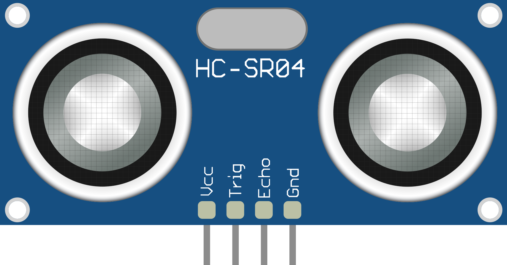

<h3 align="center">HC-SR04 Ultrasonic Sensor</h3>
<div align="center">


This folder contains example programs and a small C++ interface for using the HC-SR04 ultrasonic distance sensor on AVR microcontrollers.

</div>

## Features

- Simple example programs showing trigger/echo timing on AVR.
- A lightweight C++ interface (header/source) for measuring distance using the HC-SR04.
- Example programs for both a direct `main.cpp` demo and a small library-style interface (`sonic_distance_icp.*`).

## How to Use

1. **Include the header:**
   ```cpp
   #include "sonic_distance_icp.h"
   ```

2. **Create and initialize the sensor object (example):**
   ```cpp
   // Pin definitions and initialization depend on your board.
   SonicDistanceICP sensor(trigger_port, trigger_pin, echo_port, echo_pin);
   ```

3. **Read distance:**
   ```cpp
   // In your loop or main:
   uint16_t distance_cm = sensor.ReadCm(); // or sensor.Read();
   ```

4. **Alternative simple example:**
   - See `main.cpp` and `example_sonic_distance.cc` for straightforward implementations that use direct timing on the echo pin and print results via USART.

## Example Files

- `C/main.cpp` - A minimal demo using direct trigger/echo timing.
- `C/example_sonic_distance.cc` - An example showing how to use the simple sonic distance code.
- `C/example_sonic_distance_icp.cpp` - Example that uses the `sonic_distance_icp.*` pair.
- `C/sonic_distance_icp.h` / `C/sonic_distance_icp.cc` - Header and implementation for a small C++ interface.
- `C/sonic-distance.h` / `C/sonic-distance.cc` - Alternate implementation files (legacy or variant).

## Compilation

A sample Makefile is included at `C/Makefile`.

Build an example (from the `AVR/HC-SR04/C` directory):

```
make filename=main.cpp
```

Or build a different example, for instance:

```
make filename=example_sonic_distance_icp.cpp
```

To upload (if your Makefile supports an `upload` target and your programmer is configured):

```
make filename=example_sonic_distance_icp.cpp upload
```

## Resources

- Blog Post (Español): []{https://jackestar.netlify.app/Blog/Baremetal/ultra_sonic.html}


---

Feel free to update the paths, links, and additional instructions based on your project specifics and environment.
